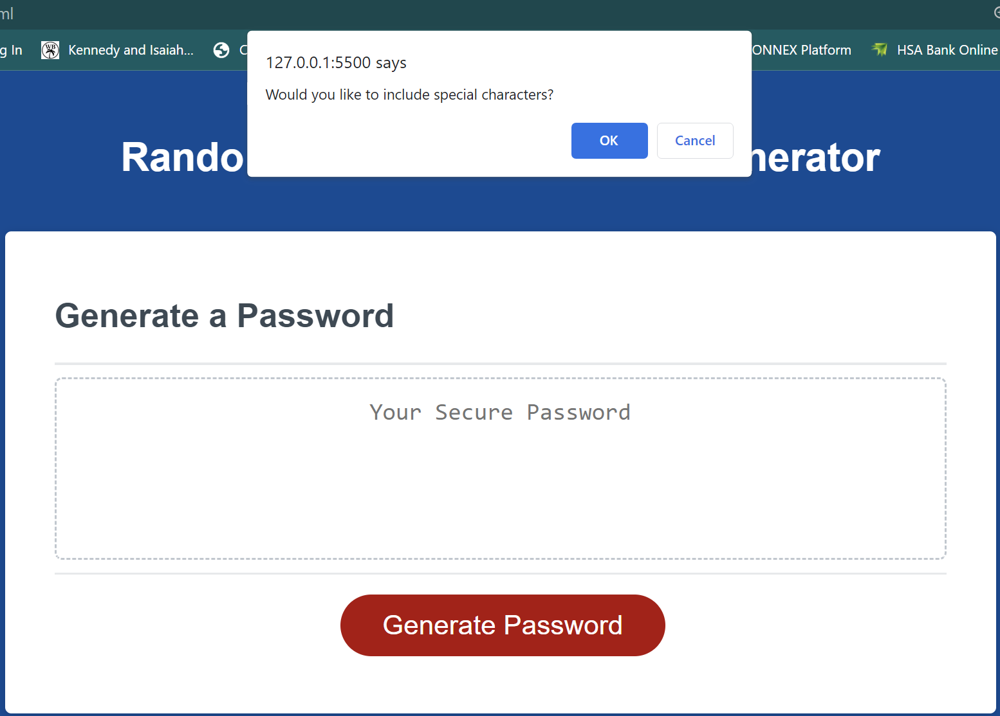

# 03 JavaScript: Password Generator

## Your Task

This week's Challenge requires you to modify starter code to create an application that enables employees to generate random passwords based on criteria that they’ve selected. This app will run in the browser and will feature dynamically updated HTML and CSS powered by JavaScript code that you write. It will have a clean and polished, responsive user interface that adapts to multiple screen sizes.

The password can include special characters. If you’re unfamiliar with these, see this [list of password special characters](https://www.owasp.org/index.php/Password_special_characters) from the OWASP Foundation.

## User Story

```
AS AN employee with access to sensitive data
I WANT to randomly generate a password that meets certain criteria
SO THAT I can create a strong password that provides greater security
```

## Acceptance Criteria

```
GIVEN I need a new, secure password
WHEN I click the button to generate a password
THEN I am presented with a series of prompts for password criteria
WHEN prompted for password criteria
THEN I select which criteria to include in the password
WHEN prompted for the length of the password
THEN I choose a length of at least 8 characters and no more than 128 characters
WHEN asked for character types to include in the password
THEN I confirm whether or not to include lowercase, uppercase, numeric, and/or special characters
WHEN I answer each prompt
THEN my input should be validated and at least one character type should be selected
WHEN all prompts are answered
THEN a password is generated that matches the selected criteria
WHEN the password is generated
THEN the password is either displayed in an alert or written to the page
```

## Order of Operations

#### The first thing you need to do once you have your base functions down is generate the different variables:
<pre>
var inputs = [""]
var uppercases = "ABCDEFGHIJKLMNOPQRSTUVWXYZ"
var lowercases = "abcdefghiklmnopqrsttuvwxtz"
var numbers = "0123456789"
var specials = "*&^%$#@!?><{}[]"
var randPassword = ""
</pre>

#### The next thing you will need to do is to create the function to tell the generate password button to write a password in the text area:
<pre>
function writePassword() {
    var password = generatePassword();
    var passwordText = document.querySelector("#password");
    passwordText.value = password;
}
</pre>

#### Now that we have our functions written, you will want to write a function to generate your first prompt:
<pre>
function generatePassword() {
    var passLength = prompt("How many characters would you like your password to be?")
}
</pre>


#### The next step is to define the minimum and maximum lengths of the password. We can do this with the following "IF" statement:
<pre>
if (passLength < 8 || passLength > 128 || isNaN(passLength)) {
    alert("Ah ah ah - You must enter a number between 8 and 128");
    return
  }
</pre>


#### After that we want to request each of the different kinds of characters:
  <pre>
  var lowercaseConfirm = confirm("Would you like to include lowercase letters?");
  if (lowercaseConfirm === true) {
    for (var i = 0; i < lowercases.length; i++) {
      inputs.push(lowercases[i]);
    }
    console.log(inputs)
  }
  </pre>
  
  <pre>
  var uppercaseConfirm = confirm("Would you like to include uppercase letters?");
  if (uppercaseConfirm === true) {
    for (var i = 0; i < uppercases.length; i++) {
      inputs.push(uppercases[i]);
    }
    console.log(inputs)
  }
  </pre>
  
  <pre>
  var numberConfirm = confirm("Would you like to include numbers?");
  if (numberConfirm === true) {
    for (var i = 0; i < numbers.length; i++) {
      inputs.push(numbers[i]);
    }
    console.log(inputs)
  }
  </pre>
  
  <pre>
  var specialsConfirm = confirm("Would you like to include special characters?");
  if (specialsConfirm === true) {
    for (var i = 0; i < specials.length; i++) {
      inputs.push(specials[i]);
    }
    console.log(inputs)
  }
  </pre>
  

#### 